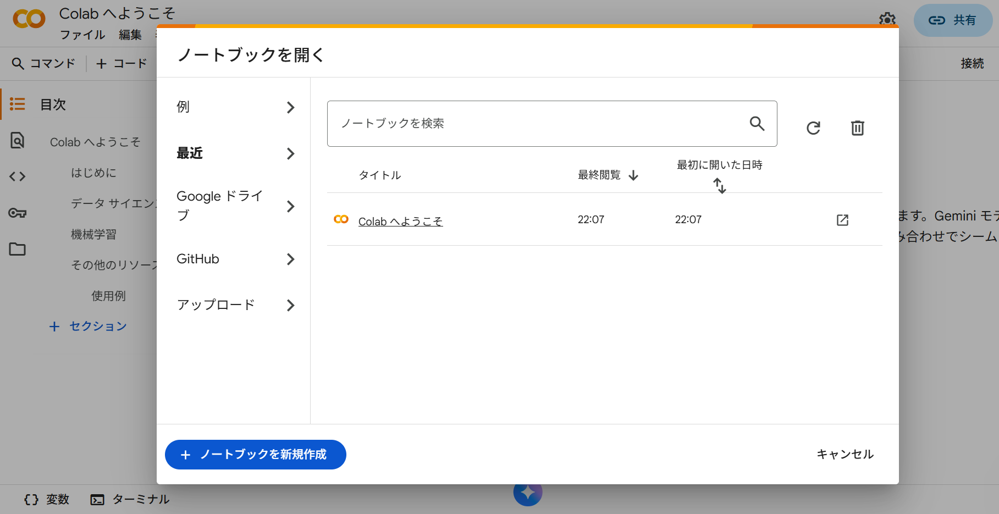
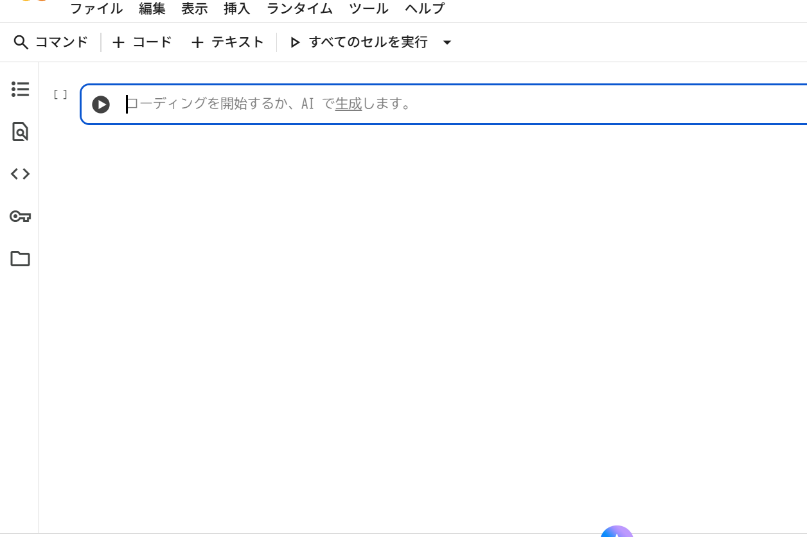
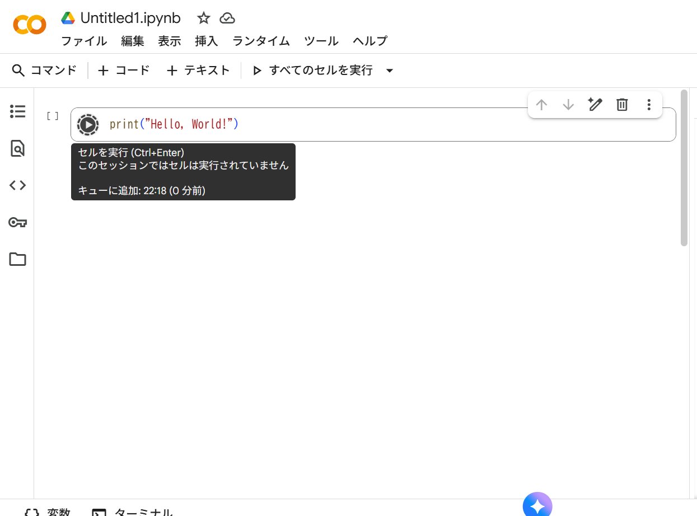
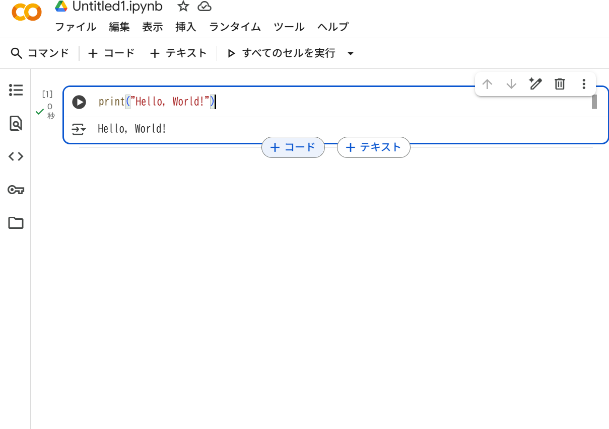

# もし環境構築が上手くいかなかったときのために
このテキストはもし環境構築が上手くいかなかったときに代替手段として Google Colab を用いる際のチュートリアルとして作成したものです。

## 1. Google Colab へアクセス
[Google Colab](https://colab.research.google.com/?hl=ja) へアクセスしましょう。以下のような画面が表示されるはずです。



左下の"+ノートブックの新規作成"をクリックしましょう。

## 2. ノートブックを編集する
しばらく待つと以下のようなセルが移った画面が出てきます。このセル上にプログラムを書きます。



例えば
```python
print("Hello, World")
```
と入力して左の再生ボタンのような横三角のボタンを押せば、しばらくすると出力が表示されます。下の画像は出力が表示されるまでの待機中の画面。



## 3. 新しいセルを追加する
新しいセルを追加するためには今のセルの枠線部分に触れると"+コード"のような文字が出てくるので、それをクリックすればよいです。

