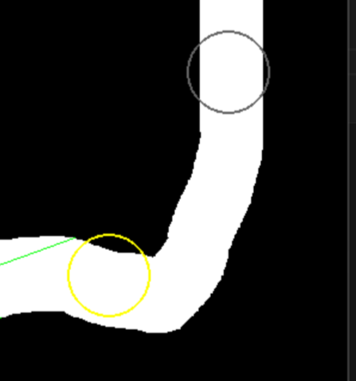

# 今回のAIのチューニング方法について
$Q$-学習を実際に行う際に一番面倒くさいパートは、どのように今考えている問題をマルコフ決定過程に落とし込むかということです。この文章は今回のレースゲームで実際にやったことについて書きます。

## 状態とアクション
状態とアクションをある程度計算できるスケールに落とし込む必要があります。

### アクション
アクションの方が比較的簡単です。実装部分は`car.py/update_ai`内の以下の部分です。

```python
if action == 0:
    self.angle -= ROTATION_SPEED
elif action == 2:
    self.angle += ROTATION_SPEED
if action < 3:
    self.speed = min(self.speed + ACCELERATION, MAX_SPEED)
elif action == 3:
    self.speed = max(self.speed - BRAKE_POWER, 0)
elif action == 4:
    self.speed = max(self.speed - FRICTION, 0)
```

`action`は5つの候補があり、

1. 加速しながら左折
2. 加速しながら右折
3. 加速しながら直進
4. 減速
5. 何もしない

となっています。

### 状態

状態は視線を伸ばして、壁があるかどうかを確認しました。トレーニング中に表示される緑の光線はAIの視線です。


前方に9本の直線が等間隔に伸びており、近い部分と遠い部分が、それぞれコース内かコース外かということを見ています。つまり、

- 各光線上に2点、その点がコースの内側か外側かを見ている場所がある。
- 光線は9個ある。

ということで、状態数は $2^9=512$ 個となります。

## 報酬の設定
報酬の設定です。こちらもそれなりに面倒で色々と試行錯誤しました。

該当箇所は`training.py`の以下の部分です。

```python
reward = 0
if car.is_off_course:
    reward = -100
    done = True
elif counter > MAX_STEP:
    done = True
else:
    # 現在の目標チェックポイントまでの距離を計算
    current_dist_to_checkpoint = math.sqrt((car.x - cx)**2 + (car.y - cy)**2)

    # 報酬シェイピング: 前のフレームより近づいていれば報酬
    distance_diff = prev_dist_to_checkpoint - current_dist_to_checkpoint
    reward += distance_diff * 0.1
    prev_dist_to_checkpoint = current_dist_to_checkpoint

    # チェックポイント通過判定
    if current_dist_to_checkpoint < checkpoints[next_checkpoint_idx][2]:
        reward += 100
        next_checkpoint_idx = (next_checkpoint_idx + 1) % len(checkpoints)

        cx, cy, _ = checkpoints[next_checkpoint_idx]
        prev_dist_to_checkpoint = math.sqrt((car.x - cx)**2 + (car.y - cy)**2)

    if car.speed < MINIMUM_SPEED:
        reward -= SPEED_PENALTY
```

主にやってることは

- コースアウトは大幅減点
- チェックポイントに近づいていってたら加点
- チェックポイントを通過したら大幅加点
- 速度を出していない場合は減点

です。ちなみに学習中に見えるコース中の丸い円がチェックポイントになります。チェックポイントを通過したら次のチェックポイントになるようにチェックポイントを適宜変えるため[^1]次に向かうべきチェックポイントは黄色になっています。



[^1]:なので厳密にはマルコフ決定過程として定式化するなら次のチェックポイントも状態として考慮する必要があり、実は今回の実装は厳密なマルコフ決定過程にはなっていない！ただしこの方がパフォーマンスは良い。