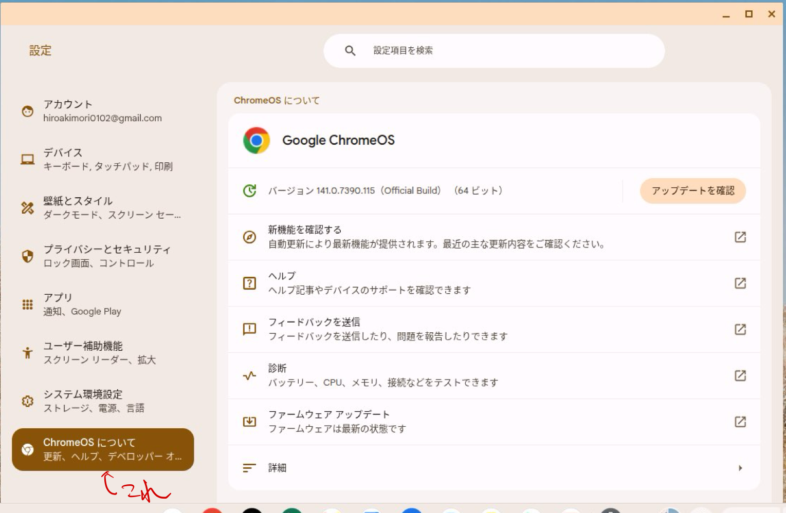
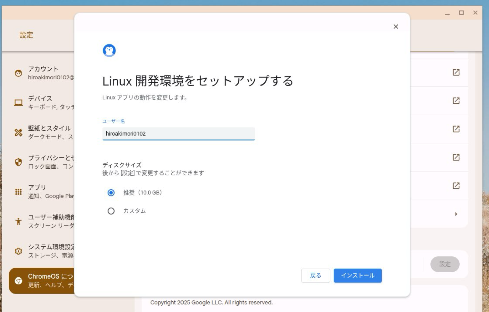

# 2. Linux 開発環境の有効化
プログラムを実行するためには、プログラムを実行してもらうようにオペレーティングシステム(以下OS)に指令を与える必要があります。そのため、まずOSに指令を出すための環境を整えましょう。幸い Chromebook は容易に Linux の仮想環境が構築できるので、これを用いない手はないでしょう。

## 2.1.
ホーム画面左下にあるボタンをクリックしてランチャーを開き、設定アプリを探して開きます。


## 2.2.
設定メニューから"ChromeOSについて"をクリックして、その中にある"Linux 開発環境"の横にある設定をクリックします。




## 2.3.
ユーザ名やディスクの設定は初期設定のままで良いです。ただし分かる人は勝手に変更してもらっても構いません。



インストールが自動的に始まるのでしばらく待ちます。

間違って"キャンセル"をクリックしてしまった場合は1.2.からやり直しです。


## 2.4.
終わったら以下の画面になるので、"次へ"をクリックしてください。


## 2.5.
"次へ"クリックした場合、自動的に以下のように黒い画面のターミナルが立ち上がるはずです。

これが立ち上がっていれば、手順1.7.へ、そうでなければ手順1.6.へ。


## 2.6.
万一ターミナルが立ち上がってない場合は、左下のボタンをクリックしてランチャーの中からターミナルを選択します。もし手順1.3.でインストールを完了していれば、"ターミナル"というアイコンが追加されているはずです。


以下の手順1.7.から手順1.9.は実行する順番はあまり関係ないので、どれから先にやってもらっても構いません。

## 2.7.
ターミナルで
```
python3
```
というコマンドをたたいてEnterキーを押してみましょう。Python3の対話型シェルが起動するはずです。もし起動しない場合は先生を呼んでください。


対話型シェルは`exit()`と打ち込むことで終了します。あるいはキーボードで`Ctrl+D`を押すことでも終了できます。


## 2.8.
実行環境の構築という点では直接的に関係があるわけではないが、念のためパッケージを更新しておきましょう。

ターミナルで、
```
sudo apt update && sudo apt upgrade -y
```
と入力してEnterキーを押してください。すると、ターミナルの出力が高速で更新されるはずです。最初は戸惑うかもしれないが、正常な動作なので終わるまで待ちます。


## 2.9.
後々のことを見越して先に作業ディレクトリ(Windowsではフォルダと呼ばれるもの)を作成してきましょう。

ターミナルで
```
mkdir 251024
```
と入力して Enter キーを押します。

なおこれは`251024`という名前のディレクトリを作成するという意味なので、名前の重複が起こらない限り`251024`以外の名前でも問題ないです。

ただしこれは個人的な意見ですが、一日で終わるような作業を管理するためのディレクトリは`251024`のように日付で管理しておくと分かりやすいです。

このコマンド自体は何も出力しないですが、もし
```
ls
```
というコマンドを入力してEnterキーを押したときに作成したディレクトリ(例では`251024`)と名前が出力されていれば成功です。

`ls`や`mkdir`は Linux を操作するための基本的なコマンドになります。さらに体系的に勉強したい方には[新しいLinuxの教科書　第２版](https://www.sbcr.jp/product/4815624316/)をお勧めしておきます。
