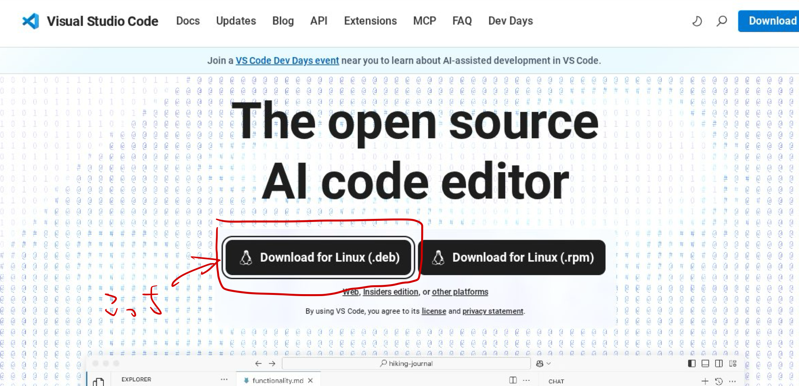
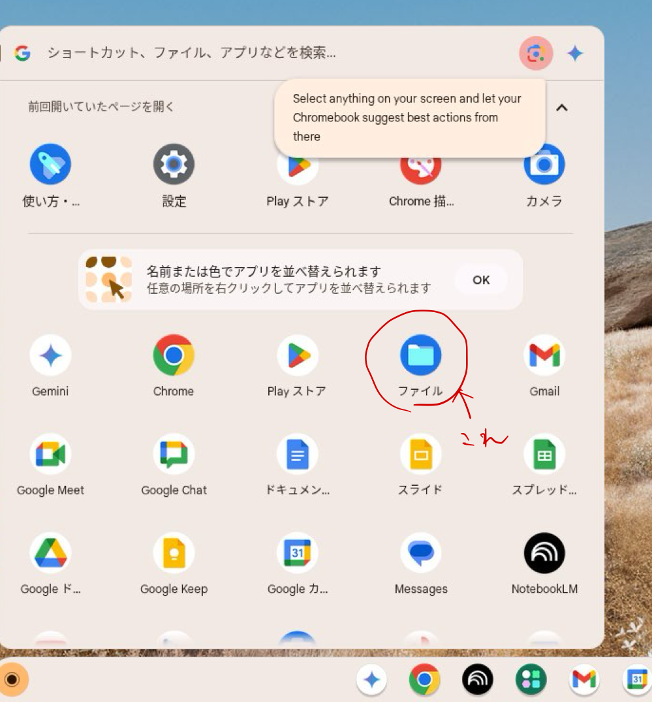
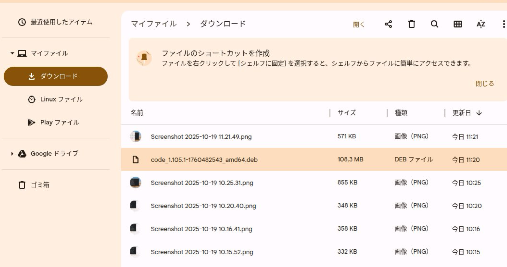
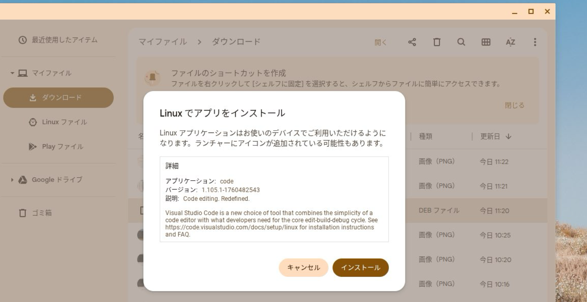
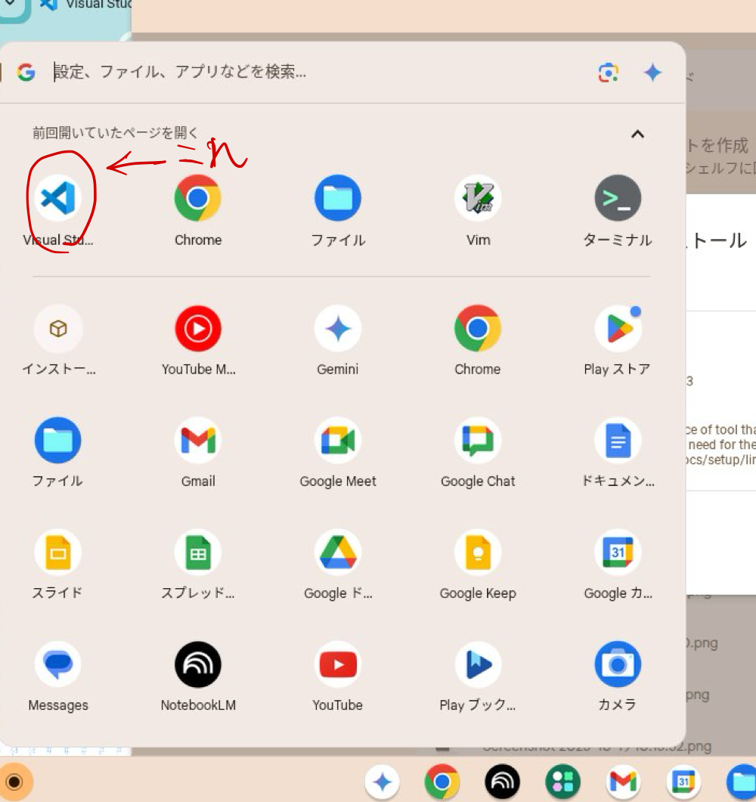
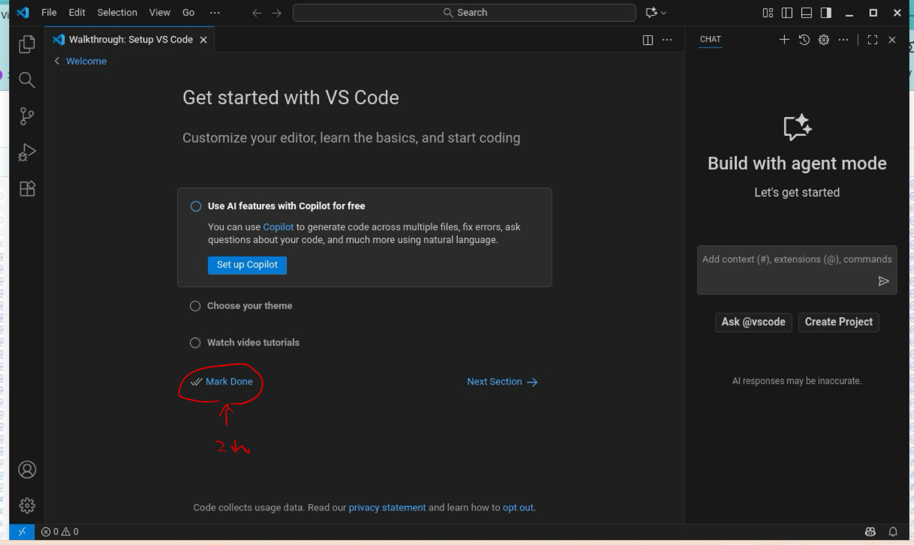
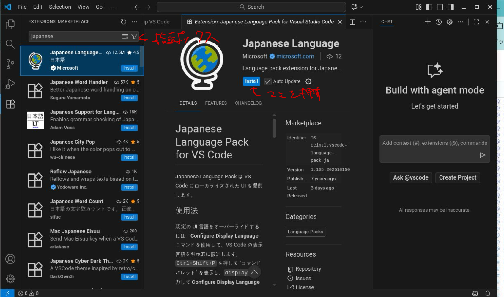
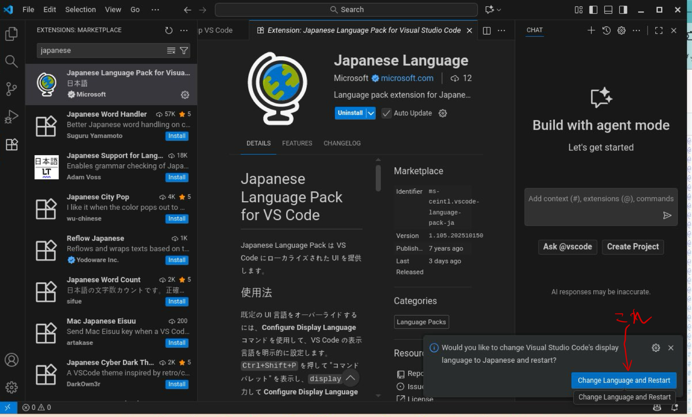

# 2. Visual Studio Code のインストール
プログラムを編集するためのソフトウェアを**エディタ(editor)**といいます。今回はエディタの中で2025年現在最も広いシェアを獲得している Visual Studio Code をインストールします。

## 2.1.
[Visual Studio Code](https://code.visualstudio.com/) のホームページに移動しましょう。現在はダウンロード画面に遷移しなくても、トップページから直接ダウンロードできるみたいなので、Linux 向けのインストーラをダウンロードします。クリックしたらダウンロードが勝手に始まるので、ダウンロードが完了するまで待機です。

なおここまでこの資料に沿って Linux を有効化していた場合には Debian がインストールされているはずなので、`.deb`形式のファイルをダウンロードすればよいです。他の方法でインストールしている人はある程度分かっているはずなので、適切な方を各自で勝手に選択してもらって構いません。

## 2.2.
通常ダウンロードしたファイルは`ダウンロード`と呼ばれるディレクトリの中に入っています。ランチャーからファイルアプリを開いてダウンロードディレクトリを確認しましょう。

## 2.3.
インストーラは2025年10月24日現在では`code_1.105.1-1760482543_amd64.deb`という名前でダウンロードされているはずです。クリックして起動しましょう。Linux 向けのアプリケーションであることをOS側で自動的に判断してくれるはずです。インストールするか聞かれたら"インストール"を選択します。すると、インストールが自動的に始まるのでしばらく待ちます。

## 2.4.
インストールが完了すればランチャーに Visual Studio Code のアイコンが表示されるようになります。これでインストールは完了です。以降は初期設定を行いますが、画面に沿って進めれば各自で進めれる部分もあると思うので、適宜好きなようにやってもらっても構いません。

## 2.5.
ランチャーから Visual Studio Code (以下 VSCode) のアイコンをクリックして VSCode を起動します。恐らく画面が英語になっているので、手順2.8.で日本語化する手順を紹介します。

Copilotの導入や背景の色の変更などが聞かれると思いますが、意味が分かるなら好きなように選択してもらって構いません。分からなければデフォルトで良いので`Mark Done`というボタンを押して飛ばしてもらっても良いです。なおここで述べた各種の設定は後から変更することができます。

## 2.6.
VSCodeの言語表示を日本語にします。なお、英語の方が分かりやすいという方はそのままで問題ありません。実際、プログラミングの世界でも英語がワールドスタンダードになっている都合、慣れてくると英語の方が色々とやりやすい部分は多かったりします。

画面左のアイコンの一番下にある`extension`をクリックします。

すると、左上に検索ボックスが現れるのでそこで`japanese`と検索します。

恐らく一番上に`Japanese Language`という名前の言語パックが現れるので、選択して中央上側に出てくる`Install`という青いボタンをクリックします。すると、インストールが始まります。

インストールが完了したら言語パックの中央の青いボタンが`Uninstall`に切り替わるはずです。そうなっていれば成功なので、右下の警告に出てくる`Change Language and Restart`を押すか、ウィンドウを一度閉じてもう一度ランチャーからVSCodeを起動すると言語が日本語になっていると思います。これで完了です。