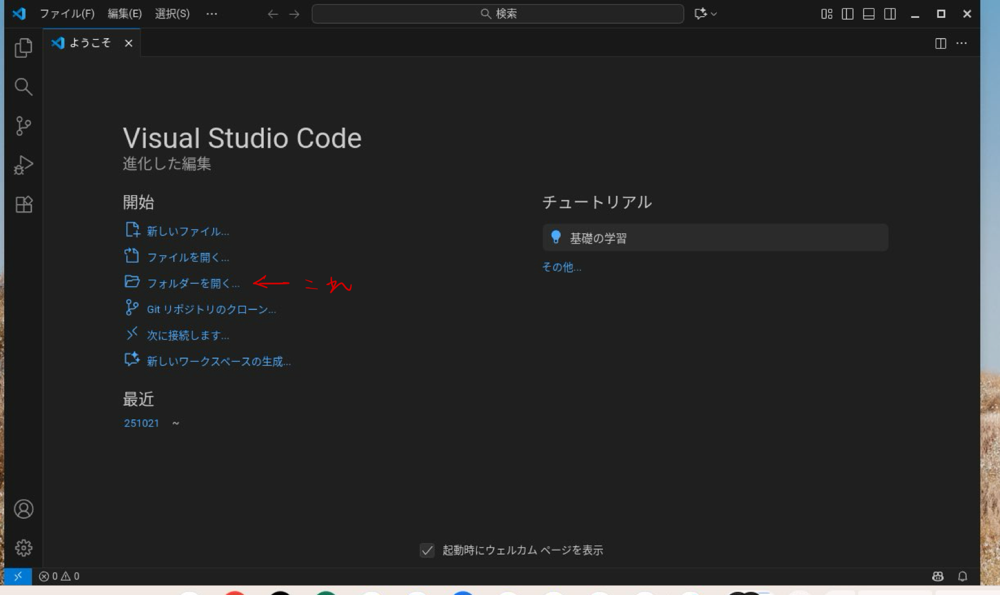
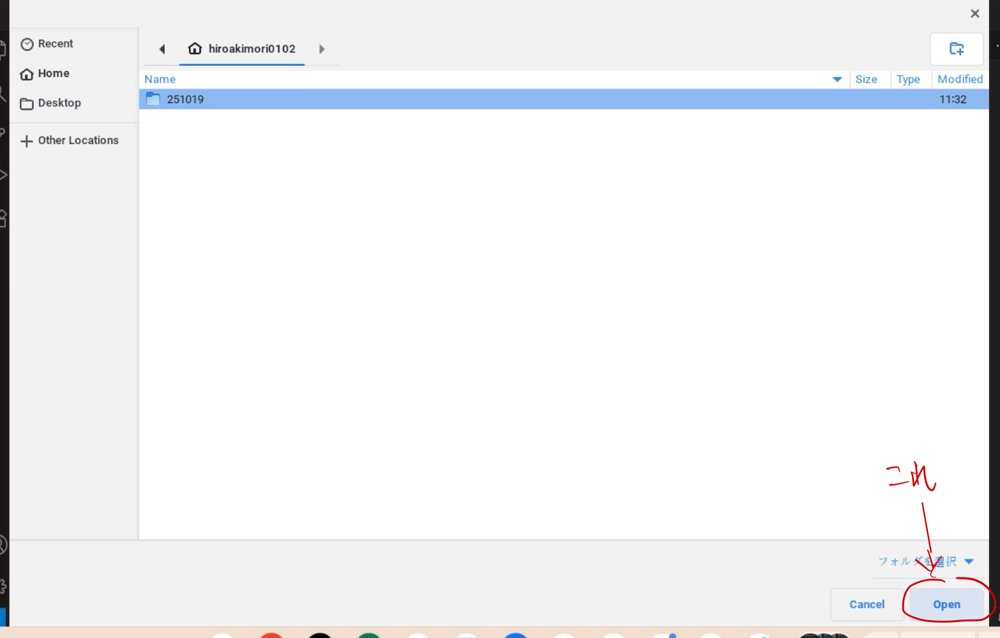
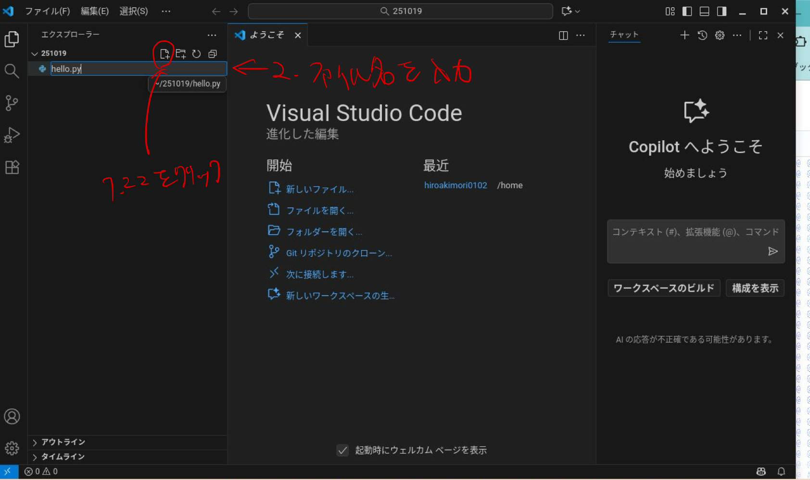
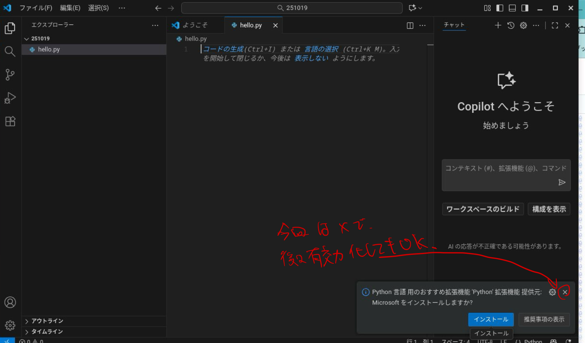
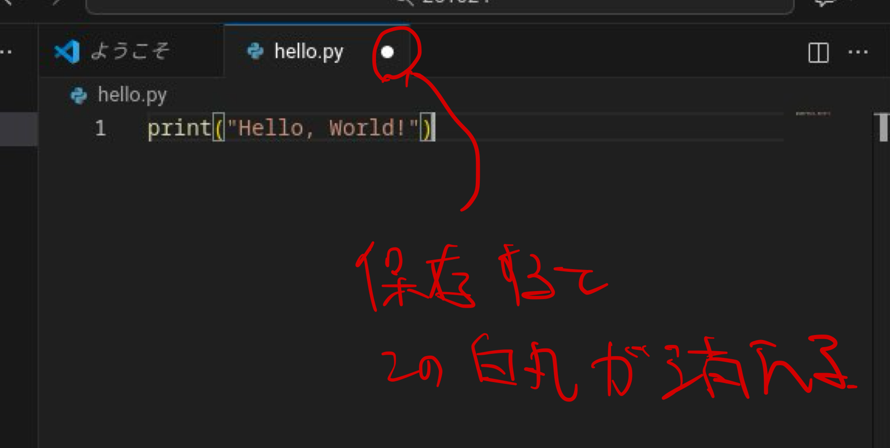
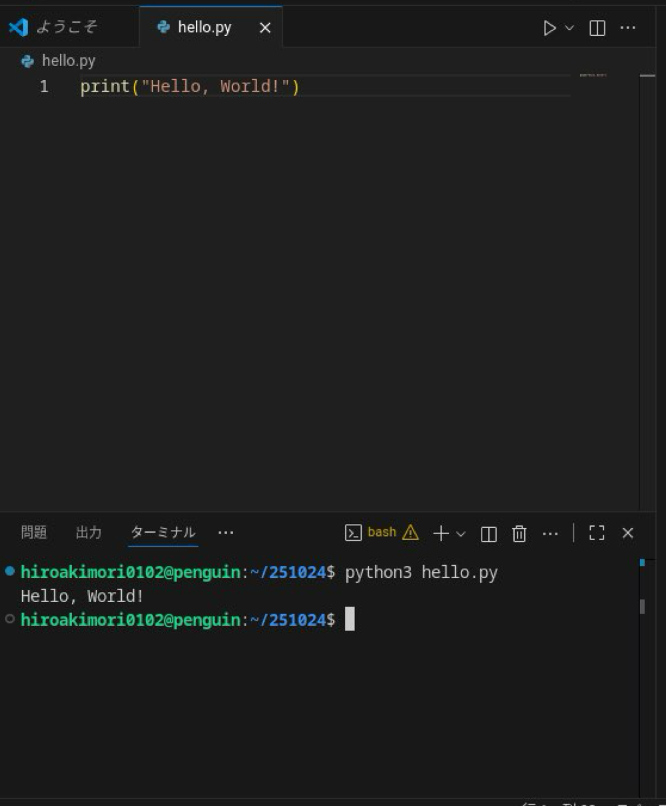

# 3. Python の実行方法
Visual Studio Code 上で Python のプログラムを実行する方法を解説します。

## 3.1.
起動したらまずコードを書くファイルを入れるフォルダー(ディレクトリ)を選択します。



## 3.2.
ファイルを保存したいフォルダーを選択して、`Open`というボタンを押します。



## 3.3.
フォルダー名の横にある小さいアイコンをクリックしてファイルを作成します。作成したファイルにここでは`hello.py`という名前を付けましょう。なお、ファイル名は何でもよいですが、Python のファイルを作成したいので、`.py`という拡張子を付けることを忘れずに。



なお初回は Python の拡張機能をインストールするように推奨されるかもしれませんが、今回はやや本筋から逸れるのでスキップします。右上の×ボタンを押して警告を消せます。

余談ですがLSPなどの拡張機能は非常に便利であり、通常はインストールする場合が多いので、勝手にしてもらう分には特に問題ありません。



## 3.4.
ファイルを編集しよう。ここでは
```python
print("Hello, World!")
```
と書いてみます。`ctrl+S`で保存できます。ファイル名の横にある白い丸が消えれば編集したファイルが保存されているということになるので忘れずに。



## 3.5.
`ctrl+Shift+@`でターミナルが起動できます。ターミナル上で
```
python3 hello.py
```
と打てばターミナル上でプログラムが実行されます。

